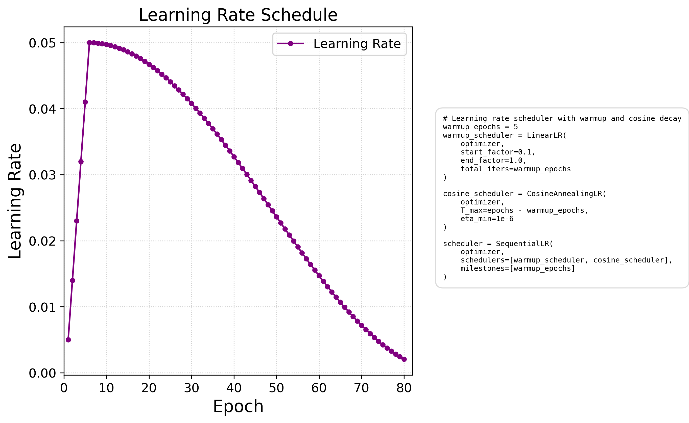

# ResNet50 ImageNet Training

A PyTorch implementation of ResNet50 training on ImageNet, with support for single/multi-GPU training, mixed precision, and various optimizations.

### [Link to HuggingFace Demo App](https://huggingface.co/spaces/dhairyashil/ImageNet1k)

## Cloud Training

This project was trained on AWS EC2 using a `g4dn.2xlarge` instance with the following specifications:

- 1 NVIDIA T4 GPU with 16GB VRAM
- 8 vCPUs (Intel Cascade Lake)
- 32GB RAM
- Deep Learning AMI with PyTorch 2.5.1 and CUDA 12.4
- Ubuntu 22.04 LTS

## Architecture

- **Model**: ResNet50 (50-layer Residual Network) ([Total params: 25.5M](summary_model.md))
- **Dataset**: ImageNet ILSVRC2012 (1.28M images)
- **Framework**: PyTorch with CUDA/MPS support

## Performance Monitoring

### Accuracy and Loss [(Link to complete text log)](log_output.md)
The training and validation accuracy achieves it's target of 70% around epoch 64 epochs.
It is shown along with the loss curves below:


### Learning Rate Schedule
The learning rate schedule consists of:
- 5 epochs linear warmup from 0.005 to 0.05 (base_lr)
- Cosine annealing decay from 0.05 to 1e-6 over remaining 85 epochs
- Total training duration: 90 epochs

This schedule helps stabilize early training while ensuring good convergence.



### Memory Usage
```bash
GPU Memory: XX.XX GB (Max: XX.XX GB)
```

## GPU Stats from AWS Console


## Directory Structure
```bash
.
├── main.py # Main training script
├── model.py # ResNet50 model implementation
├── utils.py # Training utilities and metrics
├── albumentation.py # Data augmentation pipeline
├── run_distributed.py # Multi-GPU training launcher
├── plots/
│ ├── plot_metrics.py # Training visualization
│ └── parse_logs.py # Log analysis
├── checkpoints/ # Model checkpoints
├── images/ # Training curves and visualizations
└── metrics.npz # Training metrics
```

## Features

- Distributed Data Parallel (DDP) training
- Mixed Precision Training (AMP)
- Learning Rate Scheduling
  - Linear Warmup
  - Cosine Annealing
- Automatic Mixed Precision (AMP)
- Checkpoint saving/loading
- Real-time metrics tracking
- Memory-efficient data loading

## Requirements
```bash
torch
torchvision
albumentations
numpy
matplotlib
torchinfo
```


## Training

### Single GPU
```bash
python main.py
```

### Multi GPU
```bash
#Using all available GPUs
torchrun --nproc_per_node=NUM_GPUS main.py

#Or specific number of GPUs
python run_distributed.py --num-gpus 4 --batch-size 256
```

## Key hyperparameters
- epochs = 90
- base_lr = 0.05
- momentum = 0.9
- weight_decay = 1e-4
- batch_size = 256 # per GPU

## Checkpointing

Checkpoints are saved:
- After each epoch
- Best model (highest validation accuracy)
- Every 10 epochs (for backup)

```python
checkpoint = {
'epoch': epoch,
'state_dict': model.state_dict(),
'best_acc': best_acc,
'optimizer': optimizer.state_dict(),
'scheduler': scheduler.state_dict(),
...
}
```

## Metrics Tracking

Training metrics are saved in `metrics.npz`:
- Training/Validation Accuracy
- Training/Validation Loss
- Learning Rate History

## Hardware Requirements

- GPU: NVIDIA GPU with 16GB+ VRAM recommended
- CPU: 8+ cores recommended
- RAM: 32GB+ recommended
- Storage: 300GB+ for ImageNet unpacked dataset


